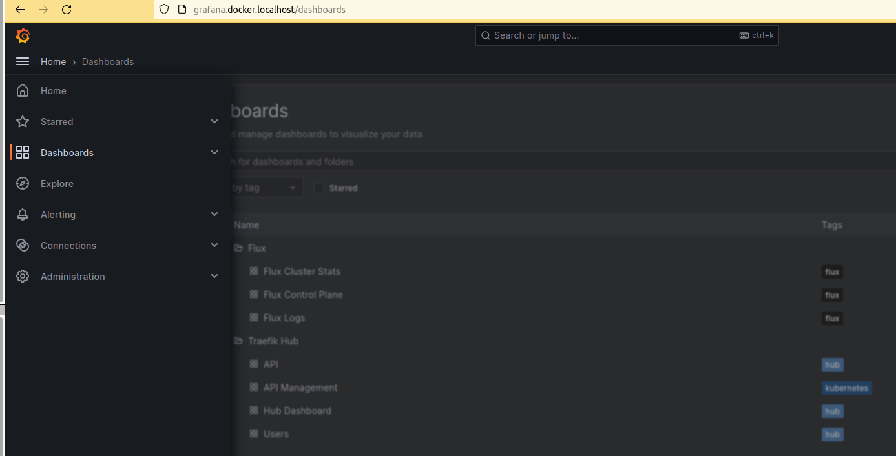

<br/>

<div align="center" style="margin: 30px;">
<a href="https://hub.traefik.io/">
  
</a>
<br />
<br />

<div align="center">
    <a href="https://hub.traefik.io">Log In</a> |
    <a href="https://doc.traefik.io/traefik-hub/">Documentation</a>
</div>
</div>

<br />

<div align="center"><strong>Traefik Hub - GitOps Complete Tutorial</strong>

<br />
<br />
</div>

<div align="center">Welcome to this tutorial!</div>

# Summary

This tutorial details how to deploy locally a Kubernetes cluster, with GitOps and Observability components.

# Prerequisites

If you'd like to follow along with this tutorial on your own machine, you'll need a few things first:

1. [kubectl](https://github.com/kubernetes/kubectl) command-line tool installed and configured to access the cluster
2. [gh](https://cli.github.com/) command-line tool installed and configured with your account
3. [Flux CD](https://fluxcd.io/flux/cmd/) command-line tool installed.
4. A Kubernetes cluster running. In this tutorial, we'll use [kind](https://kind.sigs.k8s.io). You may also use alternatives like [k3d](https://k3d.io/), cloud providers or others.

kind requires some configuration to use an IngressController on localhost, see the following example:

```shell
cat kind.config
```

```yaml
kind: Cluster
apiVersion: kind.x-k8s.io/v1alpha4
nodes:
- role: control-plane
  extraPortMappings:
  - containerPort: 30000
    hostPort: 80
    protocol: TCP
  - containerPort: 30001
    hostPort: 443
    protocol: TCP
```

All config files are in this public GitHub repository, so you may be interested to clone it:

```shell
git clone https://github.com/traefik-workshops/traefik-hub-gitops.git
cd traefik-hub-gitops
```

And create the kind Kubernetes cluster:

```shell
kind create cluster --config=kind.config
kubectl cluster-info
kubectl wait --for=condition=ready nodes kind-control-plane
```

You will also need a load balancer (LB) on this Kubernetes cluster:

```shell
kubectl apply -f https://raw.githubusercontent.com/metallb/metallb/v0.13.11/config/manifests/metallb-native.yaml
kubectl wait --namespace metallb-system --for=condition=ready pod --selector=app=metallb --timeout=90s
kubectl apply -f clusters/kind/metallb-config.yaml
```

# Fork the repo and deploy Flux CD

Flux needs to be able to commit on the repository, this tutorial can only work on a fork that *you* own.
You will also need a GitHub personal access token (PAT) with administration permissions.

```shell
gh repo fork --remote
kubectl apply -f clusters/kind/flux-system/gotk-components.yaml
```

# Deploy the stack on this cluster

Login to the [Traefik Hub UI](https://hub.traefik.io), add a [new agent](https://hub.traefik.io/agents/new) and copy your token.

Now, open a terminal and run these commands to create secret needed for Traefik Hub

```shell
export TRAEFIK_HUB_TOKEN=xxx
kubectl create namespace traefik-hub
kubectl create secret generic hub-agent-token --namespace traefik-hub --from-literal=token=${TRAEFIK_HUB_TOKEN}
```

Then, you can configure flux and launch it on the fork.

```shell
export GITHUB_ACCOUNT=xxx
export GITHUB_TOKEN=yyy

# Configure Flux CD for a repository you owned
flux create secret git git-auth  --url="https://github.com/${GITHUB_ACCOUNT}/traefik-hub-gitops" --namespace=flux-system -u git -p "${GITHUB_TOKEN}"
sed -i -e "s/traefik-workshops/${GITHUB_ACCOUNT}/g" clusters/kind/flux-system/gotk-sync.yaml

# Deploy GitRepository and Kustomization
kubectl apply -f clusters/kind/flux-system/gotk-sync.yaml
```

One can track Flux works with CLI:

```shell
flux get ks
```

You'll need to wait a few **minutes** before everything is ready.


# Use the stack

When all _kustomization_ are **ready**, one can open http://grafana.docker.localhost

Default credentials are login: admin and password: admin.

By clicking on the left menu, you are able to access to all dashboards:



# Clean up

Everything is installed in kind, so it can be done by deleting the kind cluster:

```shell
kind delete cluster
```

You may also want to delete agent in Traefik Hub UI.
